## Part 1. Инструмент **ipcalc**

#### 1.1. Сети и маски
##### Определить и записать в отчёт:
##### 1) адрес сети *192.167.38.54/13*
- вводим команду ``ipcalc 192.167.38.54/13`` получаем информацию об адресе сети:

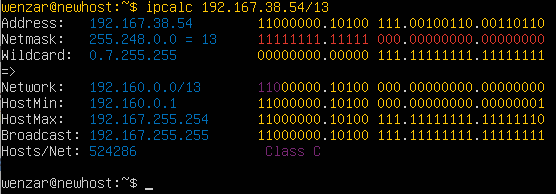

##### 2) перевод маски *255.255.255.0* в префиксную и двоичную запись, */15* в обычную и двоичную, *11111111.11111111.11111111.11110000* в обычную и префиксную

- перевод маски *255.255.255.0* в префиксную и двоичную запись ``ipcalc 255.255.255.0``:


- перевод маски */15* в обычную и двоичную ``ipcalc /15``:

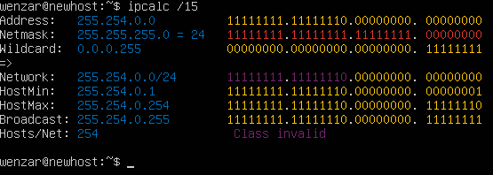

- перевод *11111111.11111111.11111111.11110000* в обычную и префиксную ``ipcalc 11111111.11111111.11111111.11110000``:

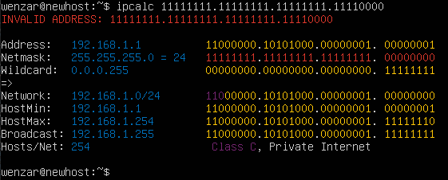

##### 3) минимальный и максимальный хост в сети *12.167.38.4* при масках: */8*, *11111111.11111111.00000000.00000000*, *255.255.254.0* и */4*

- минимальный и максимальный хост в сети *12.167.38.4/8* ``ipcalc 12.167.38.4/8``:

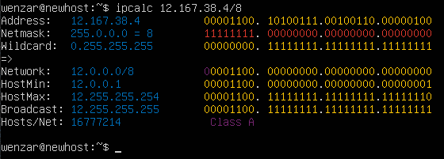

- минимальный и максимальный хост в сети *12.167.38.4/11111111.11111111.00000000.00000000* ``ipcalc 12.167.38.4/11111111.11111111.00000000.00000000``:

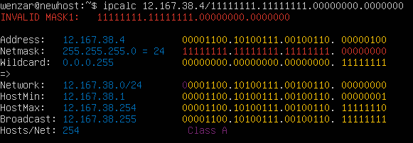

- минимальный и максимальный хост в сети *12.167.38.4/255.255.254.0* ``ipcalc 12.167.38.4/255.255.254.0``:


- минимальный и максимальный хост в сети *12.167.38.4/4* ``ipcalc 12.167.38.4/4``:


#### 1.2. localhost
##### Определить и записать в отчёт, можно ли обратиться к приложению, работающему на localhost, со следующими IP: *194.34.23.100*, *127.0.0.2*, *127.1.0.1*, *128.0.0.1*

- localhost — в компьютерных сетях, стандартное, официально зарезервированное доменное имя для частных IP-адресов (в диапазоне 127.0.0.1 — 127.255.255.254), который устанавливается на специальный сетевой интерфейс «внутренней петли» (англ. loopback)

- Проверка IP *194.34.23.100* ``ipcalc 194.34.23.100`` (не подходит):


- Проверка IP *127.0.0.2* ``ipcalc 127.0.0.2`` (подходит):


- Проверка IP *127.1.0.1* ``ipcalc 127.1.0.1`` (подходит):


- Проверка IP *128.0.0.1* ``ipcalc 128.0.0.1`` (не подходит):

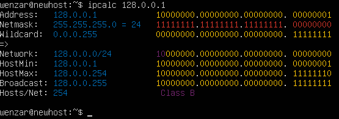

#### 1.3. Диапазоны и сегменты сетей
##### Определить и записать в отчёт:
##### 1) какие из перечисленных IP можно использовать в качестве публичного, а какие только в качестве частных: *10.0.0.45*, *134.43.0.2*, *192.168.4.2*, *172.20.250.4*, *172.0.2.1*, *192.172.0.1*, *172.68.0.2*, *172.16.255.255*, *10.10.10.10*, *192.169.168.1*

Существует классификация IP-адресов на «частные» и «публичные». Для частных (локальных) сетей зарезервированы следующие диапазоны адресов: 
- *10.0.0.0* — *10.255.255.255* (*10.0.0.0/8*), 
- *172.16.0.0* — *172.31.255.255* ( *172.16.0.0/12*),
- *192.168.0.0* — *192.168.255.255* (*192.168.0.0/16*).
- Для этих адресов в графе ``Hosts/Net`` указано ``Private Internet`` (на примере 10.255.255.255):


- *127.0.0.0* - *127.255.255.255* (зарезервировано для интерфейсов обратной связи (не используется для связи между сетевыми узлами), так называемый localhost


##### 2) какие из перечисленных IP адресов шлюза возможны у сети *10.10.0.0/18*: *10.0.0.1*, *10.10.0.2*, *10.10.10.10*, *10.10.100.1*, *10.10.1.255*

- Смотрим значения ``HostMin`` и ``HostMax``, доступны: 
  - 10.10.0.2
  - 10.10.10.10
  - 10.10.1.255


## Part 2. Статическая маршрутизация между двумя машинами

##### Поднять две виртуальные машины (далее -- ws1 и ws2):


##### С помощью команды `ip a` посмотреть существующие сетевые интерфейсы:


##### Описать сетевой интерфейс, соответствующий внутренней сети, на обеих машинах и задать следующие адреса и маски: ws1 - *192.168.100.10*, маска */16*, ws2 - *172.24.116.8*, маска */12*

- Изменяем файл *etc/netplan/00-installer-config.yaml* для каждой машины:

- ws1


- ws2

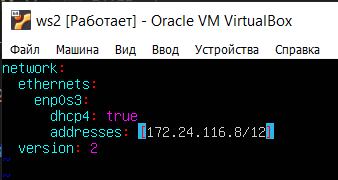

##### Выполнить команду `netplan apply` для перезапуска сервиса сети:

- ws1


- ws2


#### 2.1. Добавление статического маршрута вручную
##### Добавить статический маршрут от одной машины до другой и обратно при помощи команды вида `ip r add`:

- ws1


- ws2


##### Пропинговать соединение между машинами

- ws1


- ws2

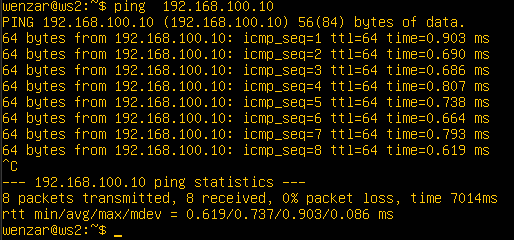

#### 2.2. Добавление статического маршрута с сохранением
##### Перезапустить машины

- Перезапускаем машины ``init 6``


##### Добавить статический маршрут от одной машины до другой с помощью файла *etc/netplan/00-installer-config.yaml*

- ws1

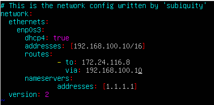

- ws2


##### Пропинговать соединение между машинами

- ws1

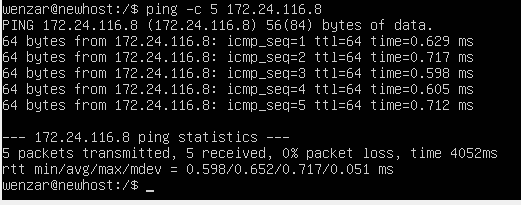

- ws2

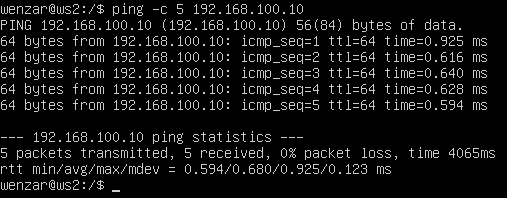

## Part 3. Утилита **iperf3**

#### 3.1. Скорость соединения
##### Перевести и записать в отчёт: 8 Mbps в MB/s, 100 MB/s в Kbps, 1 Gbps в Mbps

- 8 Mbps = 1 MB/s  
- 100 MB/s = 819200 Kbps  
- 1 Gbps = 1024 Mbps

#### 3.2. Утилита **iperf3**
##### Измерить скорость соединения между ws1 и ws2

- Запускаем ws1 в качестве сервера: 

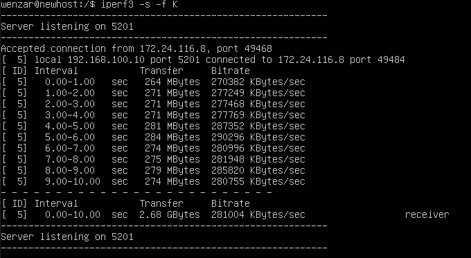

- Запускаем ws2 в качестве клиента: 


## Part 4. Сетевой экран

#### 4.1. Утилита **iptables**
##### Создать файл */etc/firewall.sh*, имитирующий фаерволл, на ws1 и ws2:
##### Нужно добавить в файл подряд следующие правила:
##### 1) на ws1 применить стратегию когда в начале пишется запрещающее правило, а в конце пишется разрешающее правило (это касается пунктов 4 и 5)
##### 2) на ws2 применить стратегию когда в начале пишется разрешающее правило, а в конце пишется запрещающее правило (это касается пунктов 4 и 5)
##### 3) открыть на машинах доступ для порта 22 (ssh) и порта 80 (http)
##### 4) запретить *echo reply* (машина не должна "пинговаться”, т.е. должна быть блокировка на OUTPUT)
##### 5) разрешить *echo reply* (машина должна "пинговаться")
- ws1 в начале пишется запрещающее правило, а в конце пишется разрешающее правило, открываем порты 22 и 80


- ws2 в начале пишется разрешающее правило, а в конце пишется запрещающее правило, открываем порты 22 и 80


##### Запустить файлы на обеих машинах командами `chmod +x /etc/firewall.sh` и `/etc/firewall.sh`


- Разница между стратегиями заключается в том, что в первом файле первым подходящим правилом для пакета является запрет, а во втором - разрешение. Применяется только первое подходящее правило, остальные игнорируются.

#### 4.2. Утилита **nmap**
##### Командой **ping** найти машину, которая не "пингуется", после чего утилитой **nmap** показать, что хост машины запущен

 - ping с ws1 на ws2


 - ping с ws2 на ws1
 
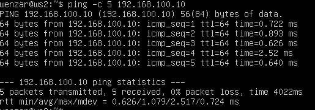

 - nmap с ws1 на ws2 (Host is up) 


 - nmap с ws2 на ws1 (Host is up) 


## Part 5. Статическая маршрутизация сети

`-` Пока что мы соединяли всего две машины, но теперь пришло время для статической маршрутизации целой сети.

**== Задание ==**

Сеть: \


##### Поднять пять виртуальных машин (3 рабочие станции (ws11, ws21, ws22) и 2 роутера (r1, r2))

#### 5.1. Настройка адресов машин
##### Настроить конфигурации машин в *etc/netplan/00-installer-config.yaml* согласно сети на рисунке.
- В отчёт поместить скрины с содержанием файла *etc/netplan/00-installer-config.yaml* для каждой машины.
##### Перезапустить сервис сети. Если ошибок нет, то командой `ip -4 a` проверить, что адрес машины задан верно. Также пропинговать ws22 с ws21. Аналогично пропинговать r1 с ws11.
- В отчёт поместить скрины с вызовом и выводом использованных команд.

#### 5.2. Включение переадресации IP-адресов.
##### Для включения переадресации IP, выполните команду на роутерах:
`sysctl -w net.ipv4.ip_forward=1`
*При таком подходе переадресация не будет работать после перезагрузки системы.*
- В отчёт поместить скрин с вызовом и выводом использованной команды.
##### Откройте файл */etc/sysctl.conf* и добавьте в него следующую строку:
`net.ipv4.ip_forward = 1`
*При использовании этого подхода, IP-переадресация включена на постоянной основе.*
- В отчёт поместить скрин с содержанием изменённого файла */etc/sysctl.conf*.

#### 5.3. Установка маршрута по-умолчанию
Пример вывода команды `ip r` после добавления шлюза:
```
default via 10.10.0.1 dev eth0
10.10.0.0/18 dev eth0 proto kernel scope link src 10.10.0.2
```
##### Настроить маршрут по-умолчанию (шлюз) для рабочих станций. Для этого добавить `default` перед IP роутера в файле конфигураций
- В отчёт поместить скрин с содержанием файла *etc/netplan/00-installer-config.yaml*.
##### Вызвать `ip r` и показать, что добавился маршрут в таблицу маршрутизации
- В отчёт поместить скрин с вызовом и выводом использованной команды.
##### Пропинговать с ws11 роутер r2 и показать на r2, что пинг доходит. Для этого использовать команду:
`tcpdump -tn -i eth1`
- В отчёт поместить скрин с вызовом и выводом использованных команд.

#### 5.4. Добавление статических маршрутов
##### Добавить в роутеры r1 и r2 статические маршруты в файле конфигураций. Пример для r1 маршрута в сетку 10.20.0.0/26:
```shell
# Добавить в конец описания сетевого интерфейса eth1:
- to: 10.20.0.0
  via: 10.100.0.12
```
- В отчёт поместить скрины с содержанием изменённого файла *etc/netplan/00-installer-config.yaml* для каждого роутера.
##### Вызвать `ip r` и показать таблицы с маршрутами на обоих роутерах. Пример таблицы на r1:
```
10.100.0.0/16 dev eth1 proto kernel scope link src 10.100.0.11
10.20.0.0/26 via 10.100.0.12 dev eth1
10.10.0.0/18 dev eth0 proto kernel scope link src 10.10.0.1
```
- В отчёт поместить скрин с вызовом и выводом использованной команды.
##### Запустить команды на ws11:
`ip r list 10.10.0.0/[маска сети]` и `ip r list 0.0.0.0/0`
- В отчёт поместить скрин с вызовом и выводом использованных команд.
- В отчёте объяснить, почему для адреса 10.10.0.0/\[маска сети\] был выбран маршрут, отличный от 0.0.0.0/0, хотя он попадает под маршрут по-умолчанию.

#### 5.5. Построение списка маршрутизаторов
Пример вывода утилиты **traceroute** после добавления шлюза:
```
1 10.10.0.1 0 ms 1 ms 0 ms
2 10.100.0.12 1 ms 0 ms 1 ms
3 10.20.0.10 12 ms 1 ms 3 ms
```
##### Запустить на r1 команду дампа:
`tcpdump -tnv -i eth0`
##### При помощи утилиты **traceroute** построить список маршрутизаторов на пути от ws11 до ws21
- В отчёт поместить скрины с вызовом и выводом использованных команд (tcpdump и traceroute).
- В отчёте, опираясь на вывод, полученный из дампа на r1, объяснить принцип работы построения пути при помощи **traceroute**.

#### 5.6. Использование протокола **ICMP** при маршрутизации
##### Запустить на r1 перехват сетевого трафика, проходящего через eth0 с помощью команды:
`tcpdump -n -i eth0 icmp`
##### Пропинговать с ws11 несуществующий IP (например, *10.30.0.111*) с помощью команды:
`ping -c 1 10.30.0.111`
- В отчёт поместить скрин с вызовом и выводом использованных команд.

##### Сохранить дампы образов виртуальных машин
**p.s. Ни в коем случае не сохранять дампы в гит!**

## Part 6. Динамическая настройка IP с помощью **DHCP**

`-` Следующим нашим шагом будет более подробное знакомство со службой **DHCP**, которую ты уже знаешь.

**== Задание ==**

*В данном задании используются виртуальные машины из Части 5*

##### Для r2 настроить в файле */etc/dhcp/dhcpd.conf* конфигурацию службы **DHCP**:
##### 1) указать адрес маршрутизатора по-умолчанию, DNS-сервер и адрес внутренней сети. Пример файла для r2:
```shell
subnet 10.100.0.0 netmask 255.255.0.0 {}

subnet 10.20.0.0 netmask 255.255.255.192
{
    range 10.20.0.2 10.20.0.50;
    option routers 10.20.0.1;
    option domain-name-servers 10.20.0.1;
}
```
##### 2) в файле *resolv.conf* прописать `nameserver 8.8.8.8.`
- В отчёт поместить скрины с содержанием изменённых файлов.
##### Перезагрузить службу **DHCP** командой `systemctl restart isc-dhcp-server`. Машину ws21 перезагрузить при помощи `reboot` и через `ip a` показать, что она получила адрес. Также пропинговать ws22 с ws21.
- В отчёт поместить скрины с вызовом и выводом использованных команд.

##### Указать MAC адрес у ws11, для этого в *etc/netplan/00-installer-config.yaml* надо добавить строки: `macaddress: 10:10:10:10:10:BA`, `dhcp4: true`
- В отчёт поместить скрин с содержанием изменённого файла *etc/netplan/00-installer-config.yaml*.
##### Для r1 настроить аналогично r2, но сделать выдачу адресов с жесткой привязкой к MAC-адресу (ws11). Провести аналогичные тесты
- В отчёте этот пункт описать аналогично настройке для r2.
##### Запросить с ws21 обновление ip адреса
- В отчёте поместить скрины ip до и после обновления.
- В отчёте описать, какими опциями **DHCP** сервера пользовались в данном пункте.

##### Сохранить дампы образов виртуальных машин
**p.s. Ни в коем случае не сохранять дампы в гит!**

## Part 7. **NAT**
`-` Ну и, наконец, в качестве вишенки на торте, я расскажу тебе про механизм преобразования адресов.

**== Задание ==**

*В данном задании используются виртуальные машины из Части 5*
##### В файле */etc/apache2/ports.conf* на ws22 и r1 изменить строку `Listen 80` на `Listen 0.0.0.0:80`, то есть сделать сервер Apache2 общедоступным
- В отчёт поместить скрин с содержанием изменённого файла.
##### Запустить веб-сервер Apache командой `service apache2 start` на ws22 и r1
- В отчёт поместить скрины с вызовом и выводом использованной команды.
##### Добавить в фаервол, созданный по аналогии с фаерволом из Части 4, на r2 следующие правила:
##### 1) удаление правил в таблице filter - `iptables -F`
##### 2) удаление правил в таблице "NAT" - `iptables -F -t nat`
##### 3) отбрасывать все маршрутизируемые пакеты - `iptables --policy FORWARD DROP`
##### Запускать файл также, как в Части 4
##### Проверить соединение между ws22 и r1 командой `ping`
*При запуске файла с этими правилами, ws22 не должна "пинговаться" с r1*
- В отчёт поместить скрины с вызовом и выводом использованной команды.
##### Добавить в файл ещё одно правило:
##### 4) разрешить маршрутизацию всех пакетов протокола **ICMP**
##### Запускать файл также, как в Части 4
##### Проверить соединение между ws22 и r1 командой `ping`
*При запуске файла с этими правилами, ws22 должна "пинговаться" с r1*
- В отчёт поместить скрины с вызовом и выводом использованной команды.
##### Добавить в файл ещё два правила:
##### 5) включить **SNAT**, а именно маскирование всех локальных ip из локальной сети, находящейся за r2 (по обозначениям из Части 5 - сеть 10.20.0.0)
*Совет: стоит подумать о маршрутизации внутренних пакетов, а также внешних пакетов с установленным соединением*
##### 6) включить **DNAT** на 8080 порт машины r2 и добавить к веб-серверу Apache, запущенному на ws22, доступ извне сети
*Совет: стоит учесть, что при попытке подключения возникнет новое tcp-соединение, предназначенное ws22 и 80 порту*
- В отчёт поместить скрин с содержанием изменённого файла.
##### Запускать файл также, как в Части 4
*Перед тестированием рекомендуется отключить сетевой интерфейс **NAT** (его наличие можно проверить командой `ip a`) в VirtualBox, если он включен*
##### Проверить соединение по TCP для **SNAT**, для этого с ws22 подключиться к серверу Apache на r1 командой:
`telnet [адрес] [порт]`
##### Проверить соединение по TCP для **DNAT**, для этого с r1 подключиться к серверу Apache на ws22 командой `telnet` (обращаться по адресу r2 и порту 8080)
- В отчёт поместить скрины с вызовом и выводом использованных команд.

##### Сохранить дампы образов виртуальных машин
**p.s. Ни в коем случае не сохранять дампы в гит!**

## Part 8. Дополнительно. Знакомство с **SSH Tunnels**

`-` Пожалуй, на этом у меня всё. Может у тебя появились ещё какие-то вопросы?

`-` Да, я хотел спросить ещё об одной вещи. На работе я краем уха услышал, что в моей компании есть некие проекты по обучению. Подробностей я не знаю, но очень хочется взглянуть... Вдруг будет полезно

`-` Действительно интересно, но как в этом помогу тебе я?

`-` Дело в том, что, чтобы добраться до этих проектов, нужно получить доступ к закрытой сети. Можешь посоветовать что-нибудь по этому поводу?

`-` Ну ты, конечно, даёшь... Не уверен на все сто, что это поможет, но могу рассказать тебе про **SSH Tunnels**.

**== Задание ==**

*В данном задании используются виртуальные машины из Части 5*

##### Запустить на r2 фаервол с правилами из Части 7
##### Запустить веб-сервер **Apache** на ws22 только на localhost (то есть в файле */etc/apache2/ports.conf* изменить строку `Listen 80` на `Listen localhost:80`)
##### Воспользоваться *Local TCP forwarding* с ws21 до ws22, чтобы получить доступ к веб-серверу на ws22 с ws21
##### Воспользоваться *Remote TCP forwarding* c ws11 до ws22, чтобы получить доступ к веб-серверу на ws22 с ws11
##### Для проверки, сработало ли подключение в обоих предыдущих пунктах, перейдите во второй терминал (например, клавишами Alt + F2) и выполните команду:
`telnet 127.0.0.1 [локальный порт]`
- В отчёте описать команды, необходимые для выполнения этих четырёх пунктов, а также приложить скриншоты с их вызовом и выводом.

##### Сохранить дампы образов виртуальных машин
**p.s. Ни в коем случае не сохранять дампы в гит!**